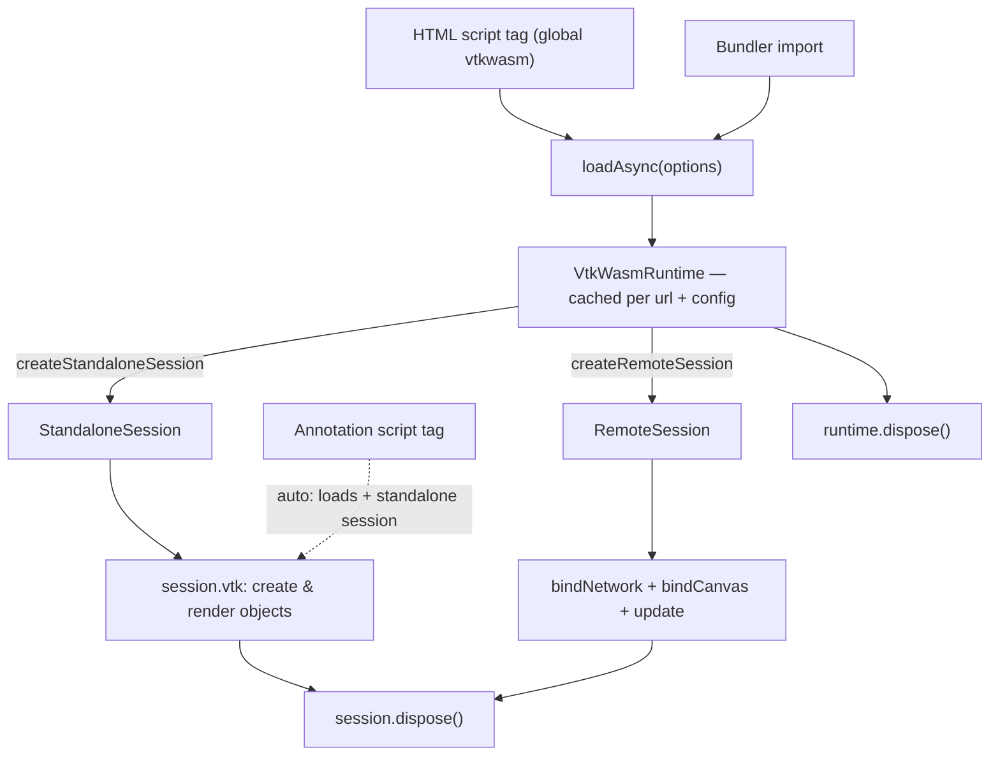

# Loading VTK.wasm

Everything starts with a single call: [`loadAsync(options)`](/api/@kitware/vtk-wasm/functions/loadAsync) returns a [`VtkWasmRuntime`](/api/@kitware/vtk-wasm/classes/VtkWasmRuntime) — a loaded WebAssembly module that acts as the factory for sessions.



```js
import { loadAsync } from "@kitware/vtk-wasm";

const runtime = await loadAsync({
  url: "https://gitlab.kitware.com/api/v4/projects/13/packages/generic/vtk-wasm32-emscripten/9.6.20260228/vtk-9.6.20260228-wasm32-emscripten.tar.gz",
});
```

First you need `loadAsync` on the page. Pick whichever fits your setup (see [Adding VTK.wasm to a Project](./integration.md)):

- [HTML Script Tag](./integration.md#html-script-tag) — no build step; `loadAsync` lives on the global `vtkwasm` object.
- [Bundler](./integration.md#bundler) — `import { loadAsync } from "@kitware/vtk-wasm"`.

For the complete, generated list of exported functions and classes, see the [API Reference](/api/).

## Choosing options

`loadAsync` takes one options object. The most common choices are conceptual; the full list with types is in the [API reference](/api/@kitware/vtk-wasm/functions/loadAsync).

- **Where to load from** — `url` points at a directory or a `.tar.gz` bundle. Skip it when the module is already loaded as a script. `wasmBaseName` (default `"vtk"`) and `urlIsGzip` adjust how the bundle is located.
- **Rendering backend** — `rendering: "webgl"` (default) or `"webgpu"`. WebGPU requires async execution and is switched on automatically.
- **Execution mode** — `exec: "sync"` (default) or `"async"`. Async unlocks WebGPU and non-blocking calls but requires [JavaScript Promise Integration (JSPI)](https://v8.dev/blog/jspi) support in the browser.
- **Console output** — pass `print` / `printErr` to pipe C++ `std::cout` / `std::cerr` to JavaScript.

## Runtimes are cached

Runtimes are cached per `(url, wasmBaseName, rendering, exec)`. Calling `loadAsync` again with the same options returns the existing runtime instead of fetching and instantiating a second copy, so it is safe to call from multiple places.

## Creating sessions

A runtime does nothing on its own — it creates **sessions**:

```js
const session = runtime.createStandaloneSession(); // in-browser rendering
// or
const remote = runtime.createRemoteSession();      // server-driven rendering
```

- [Standalone Session](./standalone-session.md) — create and render VTK objects entirely in the browser.
- [Remote Session](./remote-session.md) — mirror a scene driven by a server.

## Releasing a runtime

Call [`runtime.dispose()`](/api/@kitware/vtk-wasm/classes/VtkWasmRuntime#dispose) (or use a `using` declaration) to drop it from the shared cache. Note that Emscripten cannot reclaim a runtime's heap before a page reload — disposing the **sessions** is what actually frees C++ memory.

---

**Reference:** [`loadAsync`](/api/@kitware/vtk-wasm/functions/loadAsync) · [`VtkWasmRuntime`](/api/@kitware/vtk-wasm/classes/VtkWasmRuntime)
